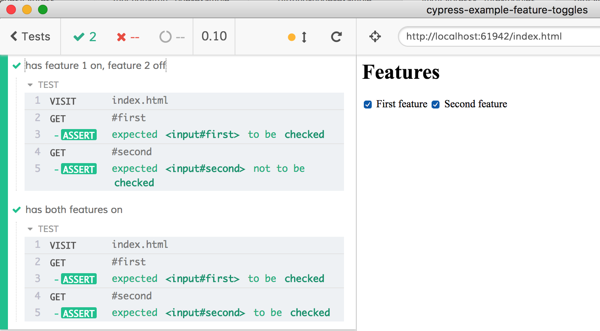

# cypress-example-feature-toggles

This example shows how to prepare for the application code setting properties on the `window` object and instead set them from the end-to-end Cypress tests.

The application code in [index.html](index.html) uses `window.features` object to determine its behavior.

```js
window.features = {
  first: false,
  second: false
}
if (window.features.first) {
  document.getElementById('first').checked = true
}
if (window.features.second) {
  document.getElementById('second').checked = true
}
```

From the Cypress test we can get access to the `window` object before the application page starts loading, see [`cy.visit`](https://on.cypress.io/visit)

```js
cy.visit('index.html', {
  onBeforeLoad (win) {
    // win is the application's "window" object reference
  }
})
```

Since we know the property name the application code will be setting, we can prepare for it. We can use `Object.defineProperty` and set read-only property that silently prevents the application code from settings its features. Instead, the test can set whatever features it wants.

See [cypress/integration/spec.js](cypress/integration/spec.js), here is a typical test test to set the first feature.

```js
it('has feature 1 on, feature 2 off', () => {
  cy.visit('index.html', {
    onBeforeLoad (win) {
      Object.defineProperty(win, 'features', {
        writable: false,
        value: {
          first: true,
          second: false
        }
      })
      // when the application code tries to set "window.features"
      // it will be silently ignored
    }
  })
  // confirm the first checkbox is checked
  cy.get('#first').should('be.checked')
  cy.get('#second').should('not.be.checked')
})
```


